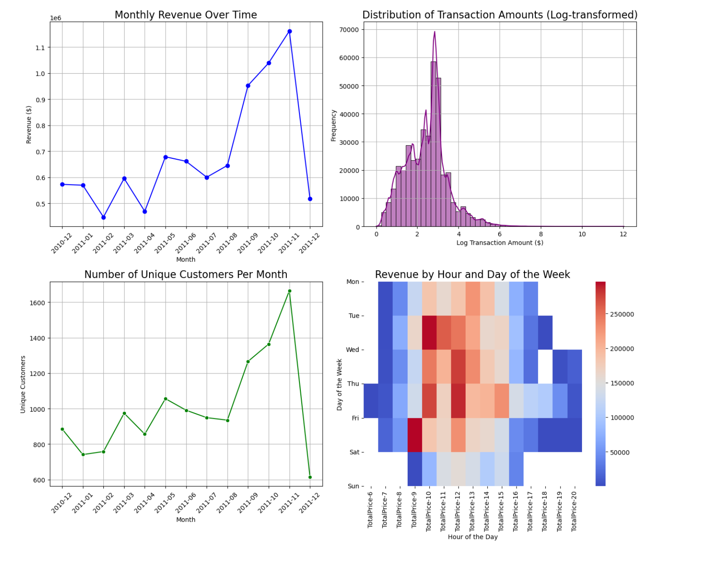
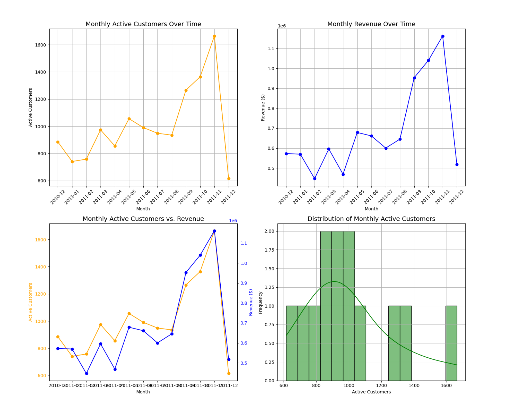
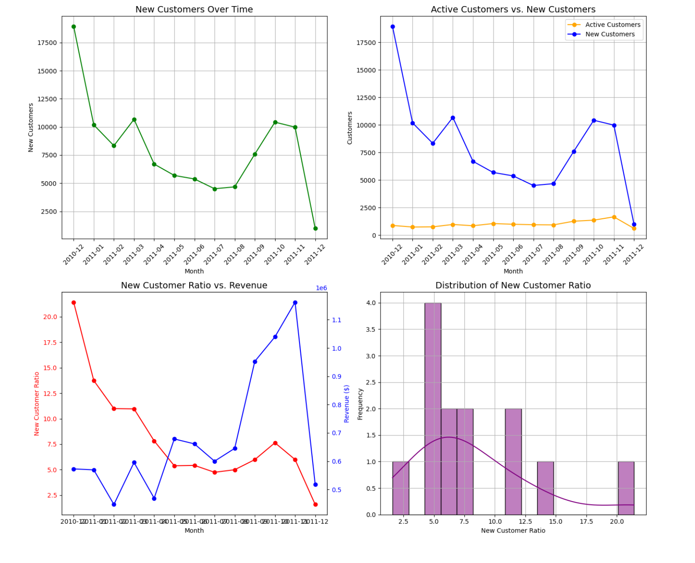
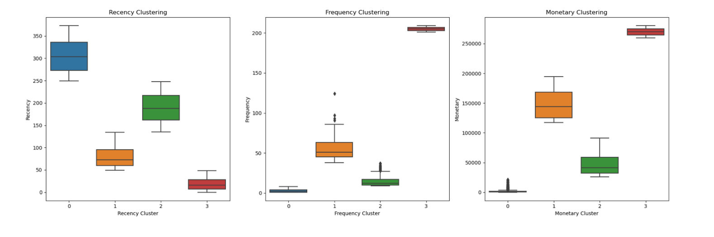
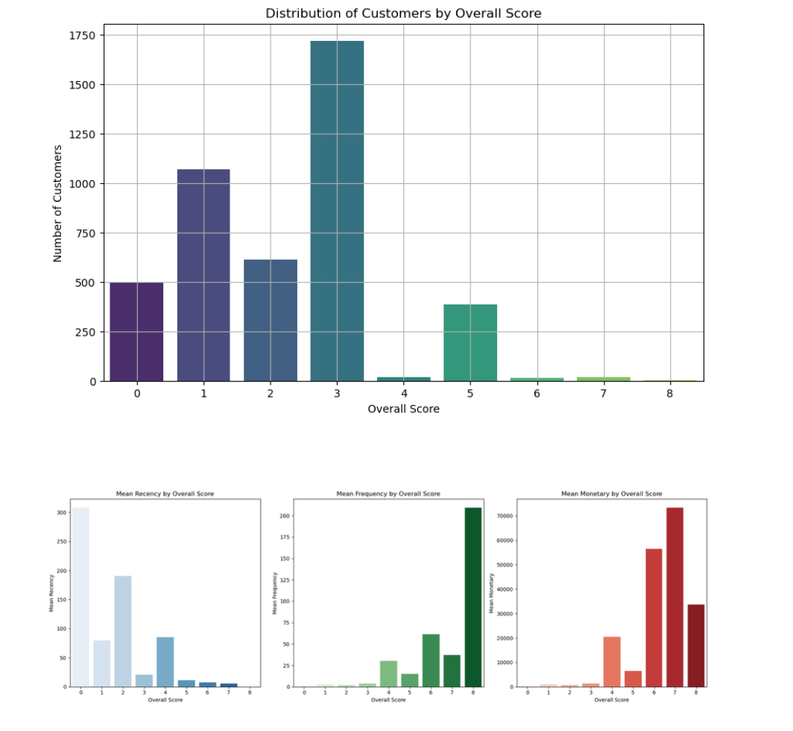
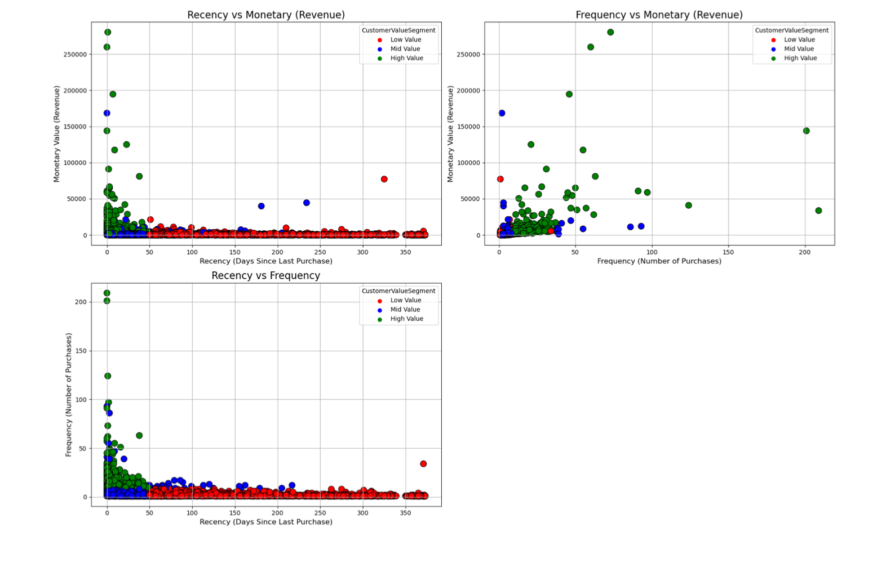

# Customer Segmentation Using RFM Analysis

This project presents a detailed analysis of customer segmentation using **RFM analysis** (Recency, Frequency, Monetary) to classify customers into different value segments based on their purchasing behavior. This project focuses on clustering customers and scoring them based on their recent purchases, frequency of purchases, and the total monetary value they contribute to the business.

## Table of Contents
- [Overview](#overview)
- [Dataset](#dataset)
- [RFM Analysis](#rfm-analysis)
- [Model Details](#model-details)
- [Customer Segmentation](#customer-segmentation)
- [Metrics](#metrics)
- [Results and Visualizations](#results-and-visualizations)
- [License](#license)

## Overview
Customer segmentation allows businesses to divide their customer base into distinct groups based on common characteristics, enabling targeted marketing strategies, customer retention efforts, and revenue optimization. In this project, we use **RFM (Recency, Frequency, and Monetary)** metrics to evaluate and segment customers.

### Key Objectives:
- **Classify customers** into different value groups (low, mid, and high value) based on their purchasing behavior.
- **Understand customer segments** using visualizations and derive actionable insights to improve business strategies.

## Dataset
The dataset used in this analysis comes from a **retail business** and contains the following columns:
- **InvoiceNo**: Unique number assigned to each transaction.
- **StockCode**: Unique product code.
- **Description**: Product description.
- **Quantity**: The quantity of products purchased.
- **InvoiceDate**: Date when the transaction occurred.
- **UnitPrice**: Price of a single product unit.
- **CustomerID**: Unique ID assigned to each customer.
- **Country**: Country of the customer.

The dataset undergoes pre-processing to clean missing values, and calculate relevant features like **TotalPrice** (Quantity * UnitPrice) and **YearMonth** (to track purchases over time).

## RFM Analysis
The **RFM analysis** evaluates customers based on three important metrics:
- **Recency**: How recently did the customer make a purchase?
- **Frequency**: How often does the customer make a purchase?
- **Monetary**: How much does the customer spend?

The data is processed to extract these three metrics for each customer:
- **Recency** is calculated as the number of days since the customer's last purchase.
- **Frequency** is the number of unique purchases a customer has made.
- **Monetary** is the total amount the customer has spent.

### Clustering for Each Metric:
- **K-Means Clustering** is applied to **Recency**, **Frequency**, and **Monetary** to group customers into clusters based on their behaviors.
- The number of clusters is determined using the **Elbow Method**, which helps identify the optimal number of clusters by analyzing the sum of squared errors (SSE).

### Our Metric

Before diving into customer segmentation, it’s crucial to identify and understand the most important metric(s) that reflect the health and growth of the business. This is often referred to as the **North Star Metric**.

#### North Star Metric

The **North Star Metric** is the key measure that best captures the core value your business delivers to customers. It acts as a guiding light for growth and success, aligning teams and efforts toward a common goal.

For an online retail business, two common examples of a North Star Metric could be:

- **Monthly Revenue**: The total revenue generated by customers each month, directly reflecting how well the business is performing in terms of product sales and customer satisfaction.
- **Orders Placed**: This metric tracks how many orders are placed each month, which indicates customer activity, engagement, and overall demand for products.

#### North Star Metric for Online Retail in This Project

In our analysis, we focus on several key metrics that align with the North Star concept for the retail industry:

1. **Monthly Revenue**: 
   - The primary metric, tracking the total revenue generated by all customer purchases each month. This metric is essential as it directly correlates with business growth and profitability.

2. **Monthly Active Customers (MAC)**: 
   - This metric reflects the number of unique customers making purchases each month. It helps assess how engaged the customer base is and whether the business is acquiring or retaining customers effectively.

3. **New Customer Ratio**:
   - The proportion of new customers compared to active customers in each time period. This metric helps understand the balance between customer acquisition and retention, providing insights into the effectiveness of marketing and growth strategies.

By focusing on these metrics, we aim to derive actionable insights to improve customer retention, boost revenue, and optimize marketing strategies in line with our overall business objectives.

### Model Details:
For each of the RFM metrics:
1. **Recency** is clustered using K-Means clustering to group customers based on their recency values. The clusters are reversed (higher scores indicate more recent purchases).
2. **Frequency** is similarly clustered with K-Means, where higher clusters reflect higher purchasing frequency.
3. **Monetary** is clustered to indicate spending levels, with higher clusters reflecting higher monetary contributions.

## Customer Segmentation
To create an overall score that reflects a customer’s total value, we sum the **Recency**, **Frequency**, and **Monetary** cluster numbers to generate an **Overall Score**. This score is then used to classify customers into the following groups:
- **Low Value**: Customers with an Overall Score of **0 to 2**.
- **Mid Value**: Customers with an Overall Score of **3 to 4**.
- **High Value**: Customers with an Overall Score of **5 or more**.

The segmentation helps businesses prioritize their customer engagement and marketing strategies:
- **Low Value**: Focus on increasing frequency or reactivating lapsed customers.
- **Mid Value**: Increase retention and encourage higher spending.
- **High Value**: Retain loyal, high-value customers with personalized offers and loyalty programs.

The key metrics in this analysis are derived from **RFM scores**:
- **Recency (R)**: The number of days since a customer's most recent purchase.
- **Frequency (F)**: The total number of purchases made by the customer.
- **Monetary (M)**: The total amount of money the customer has spent.

**Overall Score**: The sum of the **Recency**, **Frequency**, and **Monetary** cluster scores. This provides a comprehensive view of the customer’s engagement and value.

### Visualizations
Several visualizations help to interpret the customer segments:
1. **Monthly Revenue Over Time**: A line plot showing how revenue changes across different months.
2. **Distribution of Transaction Amounts**: A histogram showing the distribution of the total amounts spent by customers.
3. **Customer Segmentation by Overall Score**: Scatter plots showing the relationship between recency, frequency, and monetary value, segmented by customer value groups.
4. **Monthly Active Customers**: A plot that tracks the number of active customers over time.

The following visualizations provide key insights into customer activity and revenue trends:

1. **Monthly Revenue Over Time**: A steady increase in revenue is observed, peaking in November 2011, followed by a sharp drop in December, likely due to incomplete data.
   
2. **Distribution of Transaction Amounts (Log-transformed)**: Most transactions are small, with a few high-value transactions. The log transformation helps manage the skew in transaction amounts.
   
3. **Number of Unique Customers Per Month**: Unique customers steadily increase over time, peaking in November 2011, with a decline in December.
   
4. **Revenue by Hour and Day of the Week**: Thursdays and Fridays, especially between 9 AM and 2 PM, generate the highest revenue, highlighting peak sales periods.

 

1. **Monthly Active Customers Over Time**: The number of active customers grows steadily, peaking in November 2011, with a sharp drop in December.
   
2. **Monthly Revenue Over Time**: Revenue follows a similar pattern, peaking in November 2011, with a significant decline in December.

3. **Monthly Active Customers vs. Revenue**: Both active customer count and revenue show correlated growth trends, with the highest activity in November 2011.
   
4. **Distribution of Monthly Active Customers**: Most months see between 800 and 1,000 active customers, with a few outliers reaching higher levels.

1. **New Customers Over Time**: The number of new customers starts high in December 2010, declines over time, and reaches a low in December 2011.
   
2. **Active Customers vs. New Customers**: While active customers remain steady, the proportion of new customers is consistently lower, indicating a reliance on repeat customers.

3. **New Customer Ratio vs. Revenue**: The ratio of new customers fluctuates, with higher ratios corresponding to periods of lower revenue, suggesting that repeat customers drive higher revenues.
   
4. **Distribution of New Customer Ratio**: Most months see a new customer ratio between **3 to 7**. There are fewer months with higher ratios, indicating that new customer acquisition is sporadic.

### RFM Clustering Results

The boxplots below display clear distinctions between clusters for **Recency**, **Frequency**, and **Monetary**, showcasing the effectiveness of the clustering. 

- **Higher clusters in Frequency and Monetary** represent more valuable customers, characterized by frequent purchases and higher spending.
- **Lower recency values** (Cluster 3) indicate more recently active customers, showing a higher engagement level.

### Customer Segmentation by Overall Score

The visualizations below show the distribution of customers by **Overall Score** and their corresponding **Recency**, **Frequency**, and **Monetary** metrics:

- **Distribution of Customers by Overall Score**: Most customers fall into the mid-value segment with scores between **2 and 3**.
- **Mean Recency by Overall Score**: Lower overall scores correspond to more recent activity.
- **Mean Frequency by Overall Score**: Higher overall scores show a significant increase in purchase frequency.
- **Mean Monetary by Overall Score**: High-value customers (scores 5+) contribute substantially more revenue.

### RFM Segmentation Scatter Plots

The scatter plots below display the relationships between **Recency**, **Frequency**, and **Monetary** across different customer value segments:

- **Recency vs. Monetary**: High-value customers (green) tend to have recent purchases and contribute significantly to revenue, while low-value customers (red) show longer recency periods and lower spending.
- **Frequency vs. Monetary**: Customers with high purchase frequency and high spending are classified as high-value, whereas low-value customers have fewer purchases and lower revenue.
- **Recency vs. Frequency**: High-frequency customers are generally recent buyers, clustered in the higher-value segments, while low-value customers have longer periods since their last purchase and lower purchase frequency.

## Results:
The analysis produced the following insights:
- **Low Value Customers**: Have low recency, frequency, and monetary scores. These customers are either inactive or make infrequent purchases with low spending.
- **Mid Value Customers**: Make regular purchases but spend moderately. Retaining these customers and encouraging more frequent purchases can push them into the high-value group.
- **High Value Customers**: These are the most valuable customers, contributing the most to revenue through frequent purchases and high spending.

We also provided visualizations showing the segmentation and distributions across different RFM metrics. These insights help businesses identify which customer segments to focus on for retention, re-engagement, or targeted marketing efforts.

## Summary:
- **High Value Customers**: Focus on Improving Retention. They already purchase fre- quently, so the goal is to keep them loyal and engaged.
- **Mid Value Customers**: Focus on Improving Retention + Increasing Frequency. They need both engagement to stay loyal and encouragement to buy more frequently.
- **Low Value Customers**:  Focus on Increasing Frequency. The goal is to encourage them to buy more often and engage them more with the brand.

   
## License
This project is licensed under the MIT License. See the [LICENSE](LICENSE) file for details.
